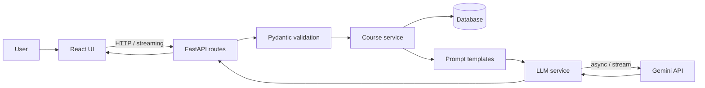

# AI Course Assistant — LLM-Powered Course Q&A and Recommendation Platform

A full-stack LLM application that answers questions about courses, recommends a course based on a learner's goal and level, and summarizes course content. Answers stream to the UI token by token.

🚀 Live Demo

Frontend:
https://agentic-ai-fy1m.onrender.com

Backend API:
https://ai-course-assistant-api.onrender.com/docs

API Health Check:
https://ai-course-assistant-api.onrender.com/health

---

## Features

- **Course Q&A:** ask a question about a selected course and get a grounded answer.
- **Recommendations:** enter goal, level and technology; get a suggestion from the available courses.
- **Course summaries:** a short summary of any course.
- **Streaming responses:** answers appear as they are generated.
- **Function calling:** the model can call a `get_course` tool to fetch course details from the database.
- **Error handling:** rate limits, timeouts and upstream failures are mapped to clean HTTP errors; no internal details are exposed.

## Tech Stack

| Layer | Technology |
|---|---|
| Frontend | React, Vite |
| Backend | Python, FastAPI, Pydantic |
| Database | SQLAlchemy with SQLite (PostgreSQL supported via `DATABASE_URL`) |
| LLM | Gemini API (Google Gemini API, Google GenAI Python SDK, async) |
| Hosting | Local Development

## Architecture



Design choices:

- **Route, service, prompt separation.** Routes handle HTTP, services hold application logic, prompts are reusable templates, and all LLM calls live in one service.
- **Only relevant data goes to the model.** Recommendations filter courses by level and technology before building the prompt, instead of sending the whole table.
- **Validate before streaming.** Course lookups and input validation run before a stream starts, so invalid requests still return a proper 404 or 422.
- **Secrets in environment variables.** API keys are never committed.

## Project Structure

```text
ai-course-assistant/
├── backend/
│   ├── app/
│   │   ├── main.py
│   │   ├── config.py
│   │   ├── database.py
│   │   ├── seed.py
│   │   ├── models/        # SQLAlchemy models
│   │   ├── schemas/       # Pydantic request/response models
│   │   ├── routes/        # API endpoints
│   │   ├── services/      # course logic + LLM service
│   │   └── prompts/       # prompt templates
│   └── requirements.txt
└── frontend/
    └── src/
        ├── api.js
        ├── App.jsx
        └── components/
```

## API Reference

| Method | Endpoint | Description |
|---|---|---|
| GET | `/health` | Health check |
| GET | `/courses` | List courses |
| GET | `/courses/{course_id}` | Get one course |
| POST | `/ai/ask` | Ask a question about a course |
| POST | `/ai/ask/stream` | Same, streamed as plain text |
| POST | `/ai/recommend` | Recommend a course |
| POST | `/ai/summarize` | Summarize a course |
| POST | `/ai/ask-with-tools` | Question answered using the `get_course` tool |

Example:

```bash
curl -X POST http://localhost:8000/ai/ask \
  -H "Content-Type: application/json" \
  -d '{"course_id": 1, "question": "What will I learn in this course?"}'
```

## Run Locally

Prerequisites: Python 3.10+, Node.js 18+, and an Anthropic API key.

### Backend

```bash
cd backend
python -m venv venv
source venv/bin/activate        # Windows: venv\Scripts\activate
pip install -r requirements.txt
```

Create `backend/.env`:

```text
LLM_API_KEY=your_api_key_here
LLM_MODEL=gemini-3.1-flash-lite
DATABASE_URL=sqlite:///./courses.db
FRONTEND_ORIGIN=http://localhost:5173
```

```bash
python -m app.seed
uvicorn app.main:app --reload
```

API docs: http://localhost:8000/docs

### Frontend

```bash
cd frontend
npm install
```

Create `frontend/.env`:

```text
VITE_API_URL=http://localhost:8000
```

```bash
npm run dev
```

Open http://localhost:5173.

## Deployment

**Backend on Render (free web service)**

1. Create a new Web Service from this repository.
2. Root Directory: `backend`
3. Build Command: `pip install -r requirements.txt`
4. Start Command: `uvicorn app.main:app --host 0.0.0.0 --port $PORT`
5. Environment variables: `LLM_API_KEY`, `LLM_MODEL`, `DATABASE_URL=sqlite:///./courses.db`, `FRONTEND_ORIGIN` (your Vercel URL), `PYTHON_VERSION=3.11.9`

**Frontend on Vercel**

1. Import this repository.
2. Root Directory: `frontend` (Vite is detected automatically).
3. Environment variable: `VITE_API_URL=<your Render URL>` (no trailing slash).

After the first deploy, set `FRONTEND_ORIGIN` on Render to the exact Vercel URL and restart the service so CORS allows the frontend.

## Security Notes

- `.env` is git-ignored; never commit API keys.
- Set a monthly spend limit on your LLM provider account, since the demo URL is public.
- Request bodies are validated with Pydantic length limits.

## Limitations
- No authentication or per-user rate limiting yet.
- No conversation history; each question is independent.
- Course data is small and seeded.
- Retrieval currently uses database filtering instead of semantic search.
- SQLite is used by default for local development.
- The application has not been deployed yet.

## Future Improvements

Planned improvements include:

* Deploy frontend and backend
* Add conversation memory using PostgreSQL
* Implement embeddings-based retrieval and RAG
* Add automated unit and integration tests
* Create an LLM evaluation dataset
* Add answer-quality evaluation
* Add user authentication
* Implement per-user rate limiting
* Improve course retrieval
* Add production observability and monitoring

---

## What This Project Demonstrates

This project demonstrates practical implementation of:

* FastAPI backend architecture
* Pydantic validation
* SQLAlchemy database integration
* Async Python
* Google Gemini API integration
* Prompt engineering
* LLM streaming
* Function/tool calling
* Service-layer architecture
* React frontend integration
* API error handling
* Environment-based configuration